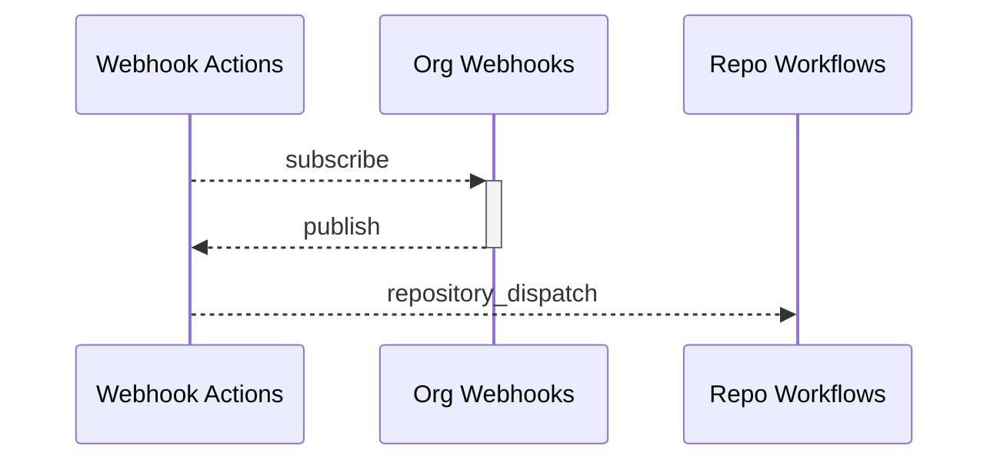

# Webhooks Actions GitHub App
Turns your Organization's Webhook events into repository dispatches.

## How it works



## Installation
Install Webhook Actions app and select the repositories which should receive dispatches.

## Configuration
Each selected repository must have a configuration file at `.github/webhook-actions/config.json`.
```
{
  "events": {
     "team_created": {},
     "team_deleted": {}
  }
}
```
## Usage
The following example, used in a GitHub Actions workflow, would trigger a workflow every time a new team is created or deleted in your organization.
```yaml
on:
  repository_dispatch:
    types: 
      - team_created
      - team_deleted
```

For more repository_dispatch types, please see [GitHub Webhooks Documentation](https://docs.github.com/en/developers/webhooks-and-events/webhooks/webhook-events-and-payloads).

A repository_dispatch type will be a combination of the webhook name and possibly an underscore and action, if the webhook includes the action type. The following are examples:
- *team_add*
- *team_added_to_repository*
- *team_created*

See [GitHub Repository Dispatch Documentation](https://docs.github.com/en/actions/using-workflows/events-that-trigger-workflows#repository_dispatch) for further information.

## Rate Limiting
Rate limiting adheres to [GitHub Apps Rate Limits](https://docs.github.com/en/developers/apps/building-github-apps/rate-limits-for-github-apps). In addition caching is used to minimize requests for installation, account, and Webhook Actions configs on each repository.

Webhook Events do include the `repository_dispatch` event type. Webhook Actions does support this event type. However, `repository_dispatch` events from Webhook Actions itself are ignored.

## Plans
### Free
Limited to a single repository and only a single webhook event. A configuration that has multiple `events` listed will default to using the **first event**. Unfortunately we cannot control order of repositories, so you must ensure you only have the application installed to a single repository. You can update this by going to your `Organization Settings -> Third-pary Access: GitHub Apps -> Webhook Actions: Configure -> Only select repositories` and ensuring that you only have a single repository selected.

### Per Unit
A repository plan coming soon.

### Flat Rate
An enterprise plan coming soon.

## Careers
Explore new opportunities with [Rise8](https://rise8.us/careers/).

