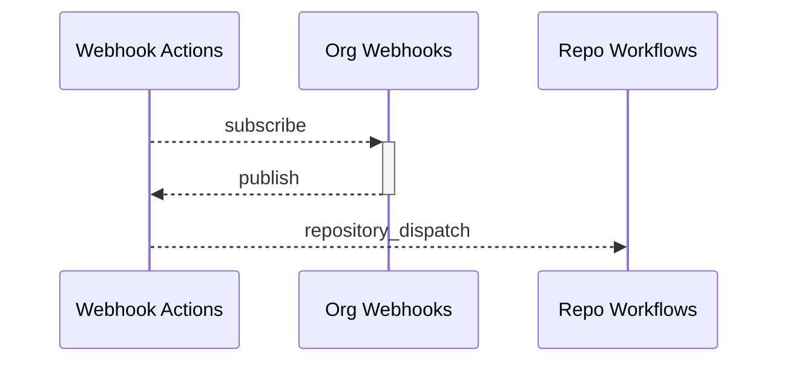

# Webhooks Actions GitHub App
Turns your Organization's Webhook events into repository dispatches.

## How it works



## Installation
Install Webhook Actions app and select the repositories which should receive dispatches.

## Usage
The following example, used in a GitHub Actions workflow, would trigger a workflow every time a new team is created in your organization.
```yaml
on:
  repository_dispatch:
    types: 
      - team_created
```

For more repository_dispatch types, please see [GitHub Webhooks Documentation](https://docs.github.com/en/developers/webhooks-and-events/webhooks/webhook-events-and-payloads).

A repository_dispatch type will be a combination of the webhook name and possibly an underscore and action, if the webhook includes the action type. The following are examples:
- *team_add*
- *team_added_to_repository*
- *team_created*

The *repository_dispatch* **webhook** will not be dispatched as this would cause a feedback loop.

See [GitHub Repository Dispatch Documentation](https://docs.github.com/en/actions/using-workflows/events-that-trigger-workflows#repository_dispatch) for further information.

