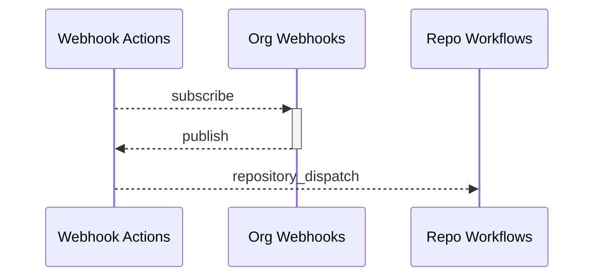

# Webhooks Actions GitHub App
Turns your organization's Webhook events into repository dispatches and securely dispatches Actions across repositories without the need for user created Personal Access Tokens. See it in the [GitHub Marketplace](https://github.com/marketplace/webhook-actions).

## How it works



## Installation
Install Webhook Actions app and select the repositories which should receive dispatches and any repositories that you want reporting repository events.

## Configuration
### Repository
To enable event dispatch subscription on a repository you must have a configuration file at `.github/webhook-actions/config.json`.
```json
{
  "events": {
     "team_created": {},
     "team_deleted": {}
  }
}
```
### Organization
To prevent unauthorized access to events across your organization's repositories it is strongly recommended to use this configuration. You must create a repository named `webhook-actions-config`. Then create a file named `repositories.json`. In the example that follows, we are adding a repo configuration for the repos named `super-awesome-app` and `not-so-awesome-app`.
```json
{
  "super-awesome-app": {
     "events": {
       "team_created": {}
     }
  },
  "not-so-awesome-app": {
     "events": {
       "team_deleted": {}
     }
  }
}
```
An organization config will override all individual repository configs if the json provides an object (even an empty object).

## Usage
The following example, used in a GitHub Actions workflow, would trigger a workflow every time a new team is created or deleted in your organization.
```yaml
on:
  repository_dispatch:
    types: 
      - team_created
      - team_deleted
```

See [Supported Events](supported-events.md).

See [Examples](./examples).

## Rate Limiting
Rate limiting adheres to [GitHub Apps Rate Limits](https://docs.github.com/en/developers/apps/building-github-apps/rate-limits-for-github-apps). In addition caching is used to minimize requests for installation, account, and Webhook Actions configs on each repository.

Any event fired from a workflow dispatched by Webhook Actions will also be ignored.

## Plans
### Free
Limited to three repositories and one webhook event per repository. A configuration that has multiple `events` listed will default to using the **first event**. Unfortunately we cannot control order of repositories, so you must ensure you only have the application installed to a single repository. You can update this by going to your `Organization Settings -> Third-pary Access: GitHub Apps -> Webhook Actions: Configure -> Only select repositories` and ensuring that you only have a single repository selected.

### Pro (Personal)
A per repository plan for personal repositories coming soon.

### Pro (Organization)
A per repository plan for organization repositories coming soon.

### Enterprise
A flat rate plan for organizations with 20+ repositories coming soon.

## Careers
Explore new opportunities with [Rise8](https://rise8.us/careers/).

